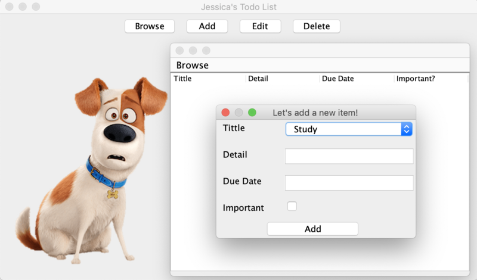

# Lightbulb! Schedular App

### Personal Project

### About

##### A schedular app that manages user’s academic and personal agenda; 
##### users can set priorities, categorize items and sort items by date, category and priority order

The app's main functions are :
- Add, edit, delete user's schedule
- Save and load user's data when the application starts
- Make a new tittle (category) and categorize items
- Browse items by tittles and importance

It also includes :
- Randomly selected animal photos 
- 2019 Holiday List using Calendar API

Implemented methods are : 

- Implementing a hierarchy, data abstractions, interfaces, 
testing, throwing exceptions, API, using design patterns
(observer/composite) and Gui Swing.

### Installation

To run the program, run Project.application.frame.MainFrame

